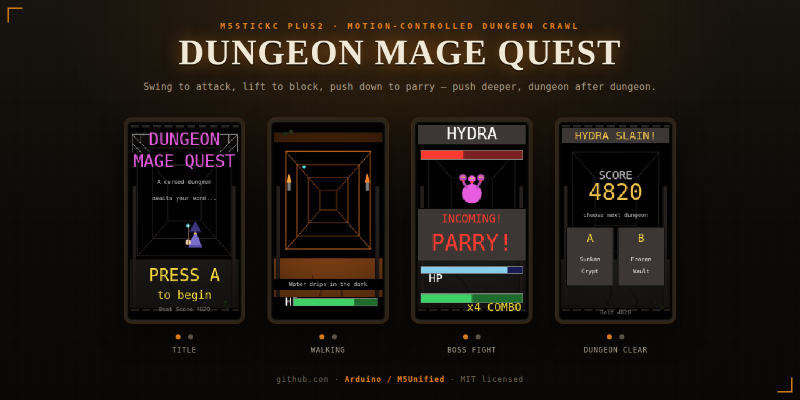

# Dungeon Mage Quest — M5StickC Plus2



A motion-controlled, first-person dungeon crawl for the M5StickC Plus2.
You walk a torchlit stone corridor automatically — no steering — and
swing the device like a wand whenever something appears ahead. Clear a
boss and you're offered a choice of the next dungeon to push into: the
run keeps going, deeper and harder, until you fall. Your score is saved
as a best on the device.

Opens on a title card with a mage silhouette over the dungeon, plus a
short square-wave startup fanfare in the spirit of an old 8-bit RPG.

## What you need

- An M5StickC Plus2
- A USB-C cable
- Arduino IDE (2.x recommended)

## One-time setup

1. **Add the M5Stack board package.** In Arduino IDE: *Preferences* →
   "Additional boards manager URLs" → add:
   `https://static-cdn.m5stack.com/resource/arduino/package_m5stack_index.json`
   Then *Tools → Board → Boards Manager*, search "M5Stack", install it.
2. **Select the board.** *Tools → Board → M5Stack → M5StickCPlus2*.
3. **Install the library.** *Tools → Manage Libraries* → search
   **M5Unified** (by M5Stack) → Install. (`Preferences.h`, used to save
   your best score, ships with the ESP32 core — nothing else to add.)
4. **Pick the port** under *Tools → Port* once the StickC Plus2 is
   plugged in, then hit Upload. Make sure the sketch stays inside a
   folder named `dungeon_mage_quest` (Arduino requires the folder and
   the `.ino` file to share a name).

## How to play

Hold the StickC Plus2 like a wand: screen facing you, USB-C port toward
the bottom, big front button under your thumb. Press it to start — the
title screen names the dungeon you're about to enter, and pressing the
button shows a one-line premise for it before you set off. From here on
you just watch and react, there's no steering.

You advance down the torch-lit, brick-walled corridor on your own —
solid stone floor and ceiling with moss patches, floor cracks, and side
support beams for a lived-in dungeon feel, torchlight fading toward the
far end, and a couple of water drips falling from ceiling cracks at
irregular, non-metronomic intervals. Occasionally a caption appears at
the bottom of the screen with a bit of flavor about the dungeon around
you — just atmosphere, no action needed. When something appears in the
distance, get ready:

- **A grey boulder = obstacle.** A cracked, moss-covered rock blocking
  the path. The screen names a gesture (ATTACK / BLOCK / PARRY) —
  perform *that* swing before the timer runs out to get past it, or take
  a hit and keep moving anyway (with a chance to just graze it for half
  damage instead).
- **A pair of glowing eyes = monster** — red for a regular monster,
  magenta for a boss near the end of the dungeon. It's still a shadow at
  a distance; by the time the fight starts it's drawn as its actual
  shape. Regular monsters, roughly in order of how deep you need to be
  to meet them:
  - **SLIME** — slow, hard-hitting, mostly demands Block.
  - **BAT** — fast, fragile, mostly demands Parry.
  - **RAT** — balanced, an even split.
  - **GOBLIN** (floor 2+) — armed and aggressive, hits harder.
  - **SKELETON** (floor 3+) — tanky, slow, brutal damage.
  - **PHOENIX** and **GRIFFIN** (floor 4+, rare) — fast, elite, punish
    hesitation.

  Every dungeon ends in one of two bosses: the three-headed **HYDRA** or
  the cursed-gaze **MEDUSA**, both tougher and scaling further the
  deeper you've pushed.

  You're dropped into a duel: swing sideways, or forward, to Attack,
  landing enough damage to win — with a chance of a bonus **CRITICAL**
  hit for extra damage. Fill the mana bar and your next swing becomes a
  big Ultimate. Landing a hit (or finishing a monster off) flashes a
  quick shimmer of magic; the monster attacks back periodically,
  randomly demanding either "BLOCK!" (lift the wand) or "PARRY!" (push
  it down), biased by its species — read the prompt each time. A clean
  hit against you flashes red across the screen. Landing hits or
  defending correctly builds a combo that boosts your damage; getting
  hit resets it, though a failed defense sometimes only **grazes** you
  for half damage instead of landing clean.
- **Gold diamond = treasure**, right before the boss — any swing grabs
  it (and if you're too slow, it's collected automatically after a
  couple of seconds, so there's no way to fail right before the fight).
- **The path splits** twice each dungeon. The screen shows two short
  options — press the front button (**A**) for the left path or the side
  button (**B**) for the right. It's flavor, not a puzzle: whichever you
  pick, the next stretch of corridor is slightly less (left) or slightly
  more (right) likely to throw a random side event at you.

Between the main encounters, you might randomly run into something extra:
a glowing **health herb** that heals you on the spot with no swing needed,
a sudden **trap** that demands a quick reflex swing, or an **ambush** — a
weaker monster jumping out with no warning at all. None of these are
guaranteed; they're just a chance each time you're walking (and the fork
choice you just made nudges that chance up or down for one stretch).

**Beat the boss** and the dungeon is cleared: you're shown your score
and a choice of two named dungeons to push into next. Picking one grants
a small heal and drops you straight into it, one floor deeper — monsters
hit harder, tougher species become possible, and the boss has more HP,
but everything is also worth more score. There's no final "you win"
screen; the run continues until you die. Your health carries across
every dungeon you push into — there's no full heal except the small
bump on clearing a boss and the occasional herb. Hit zero anywhere and
it's game over — the death screen shows your final score, the depth you
reached, and saves a new best if you beat it.

## Controls

- **Lift the wand sharply UP** → **BLOCK** — stops a BLOCK-flagged
  attack cold and reflects a hit back.
- **Push the wand sharply DOWN** → **PARRY** — stops a PARRY-flagged
  attack the same way; a distinct motion from Block so you can't just
  wave the wand and win.
- **Swing side to side (or jab forward/back)** → **ATTACK** — any
  horizontal or forward/back swing lands a hit. Obstacles only ever ask
  for Attack, Block, or Parry.

## If a swing feels backwards

If lifting the wand up registers as a Parry instead of a Block (or vice
versa), open `dungeon_mage_quest.ino` and flip this line near the top:

```cpp
static const bool BLOCK_IS_POSITIVE_Y = true;
```

Change it to `false` and re-upload.

For finer tuning, hold the side button (BtnB) while powering the device
on — it boots into a mode that streams live accelerometer readings over
Serial (115200 baud) so you can watch which axis moves, and by how much,
for each swing. Useful if:

- Swings aren't being detected at all → lower `TRIGGER_THRESHOLD_G`
- The game triggers from normal hand tremor / just holding it → raise
  `TRIGGER_THRESHOLD_G`
- One swing sometimes registers as two casts → raise `GESTURE_COOLDOWN_MS`

## Tuning the run

Near the top of the sketch:

- `NUM_OBSTACLES` / `NUM_MONSTERS` — how many of each are shuffled into
  one dungeon (a boss and the Treasure are always added as the last two
  steps)
- `WALK_DURATION_BASE_MS` / `WALK_JITTER_MS` — how long each corridor
  walk between encounters lasts
- `TUNNEL_CYCLE_MS` — how fast the wireframe tunnel animates (the
  walking "pace")
- `PLAYER_MAX_HP` / `OBSTACLE_FAIL_DMG` / `OBSTACLE_WINDOW_MS` — survival
  and obstacle difficulty
- `BOSS_BASE_HP` / `BOSS_HP_PER_DEPTH` / `MONSTER_HP_DEPTH_SCALE` — how
  much tougher bosses and regular monsters get with each dungeon you
  push into
- `SPECIES_HP` / `SPECIES_MIN_DEPTH` / `SPECIES_IS_ELITE` /
  `SPECIES_INTERVAL_MOD_MS` / `SPECIES_WINDOW_MOD_MS` /
  `SPECIES_DMG_MOD` / `SPECIES_BLOCK_BIAS_PCT` / `SPECIES_TELE_HZ` /
  `SPECIES_TELE_MS` — one entry per monster species (index matches
  `MONSTER_NAMES`), controlling when each unlocks and how its fights feel
- `CRIT_CHANCE_PERCENT` / `CRIT_MULTIPLIER` — how often your attacks crit
  and by how much
- `GRAZE_CHANCE_PERCENT` — how often a failed defense/obstacle/trap only
  costs half damage instead of a full hit
- `SCORE_OBSTACLE` / `SCORE_TREASURE` / `SCORE_MONSTER_PER_HP` /
  `SCORE_BOSS` / `SCORE_DEPTH_BONUS` — how much each kind of encounter
  is worth
- `DUNGEON_CLEAR_HEAL` — how much HP you're granted when you push into
  the next dungeon
- `WALK_EVENT_HERB_PCT` / `WALK_EVENT_TRAP_PCT` / `WALK_EVENT_AMBUSH_PCT`
  — the odds of each random side event happening on a given walk segment
  (the rest of the percentage is no event at all)
- `TRAP_FAIL_DMG` / `TRAP_WINDOW_MS` — how punishing and how fast the
  random trap event is
- `NUM_FORKS` — how many path-split moments are sprinkled into a dungeon
  (currently spaced roughly a third and two-thirds of the way through)
- `FLAVOR_LINE_CHANCE_PCT` — how often an ambient story caption shows up
  during a walk segment
- `DUNGEON_TITLE[]` / `DUNGEON_FLAVOR[]` / `DUNGEON_LORE2[]` /
  `DUNGEON_EPILOGUE[]` — the pool of dungeon names and the lore tied to
  each one (opening title card, second lore card, and the closing line
  shown on the dungeon-clear screen — all index-matched; add more
  entries to all four and bump `DUNGEON_COUNT` to expand the pool)
- `FLAVOR_LINES[]` / `FLAVOR_LINES_LATE[]` — the ambient captions shown
  mid-walk; the "late" pool leans in once you're over 60% through a
  dungeon (bump `FLAVOR_LINE_COUNT` / `FLAVOR_LINE_LATE_COUNT` to match)
- `FORK_LEFT[]` / `FORK_RIGHT[]` — the text shown for each path-split
  option (bump `FORK_COUNT` to match)
- `DEATH_LINES[]` — the random closing line on the death screen (bump
  `DEATH_LINE_COUNT` to match)
- `BOSS_LINES[]` — the random ominous line shown on the interstitial card
  right before a boss fight (bump `BOSS_LINE_COUNT` to match)
- `BOSS_NAMES[]` — the two bosses (`HYDRA`, `MEDUSA`), picked at random
  for each dungeon
- `STARTUP_JINGLE[]` — the eight `{hz, ms}` notes played once at boot,
  right before the title screen (`hz == 0` is a rest)
- `COLOR_STONE` / `COLOR_TORCH` / `COLOR_ROCK` / `COLOR_LEATHER` /
  `COLOR_STEEL` / `COLOR_MOSS` / `COLOR_MAGE_*` / `COLOR_MEDUSA_ROBE` —
  the palette used throughout, computed once in `setup()` with
  `canvas.color565(...)`

## Interactive preview

`preview/preview.html` is a standalone HTML mockup of the interface,
monster roster, combat VFX (magic kill-shine, red hit-splash, attack
shine), the control scheme, and the startup jingle — built while
designing this update, kept here for reference. It's not part of the
sketch and doesn't need to be uploaded to the device; open it in any
browser.

`docs/banner.html` is the source for the README banner above (four
device mockups composed on one page) — open it in a browser and
screenshot it again any time the interface changes.

## Ideas to extend it

- Add a shop or currency event that lets you spend score mid-run to
  heal, at the cost of some of your total.
- Give each dungeon a distinct visual palette (e.g. a blue-tinted
  "Sunken Vault", a green-tinted "Bone Catacombs") instead of one shared
  stone/torch palette.
- Add a fourth defensive gesture using `M5.Imu.getGyroData()` for a
  rotation-based "reflect" input.
- Track a small run history (last 5 scores/depths) in Preferences
  instead of just the single best.
- Let a fork's choice matter more directly — e.g. skip straight past the
  next obstacle, or guarantee rather than just bias a side event.

## License

MIT — see [LICENSE](LICENSE).
